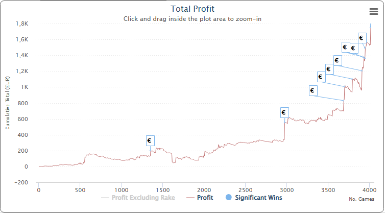

## 🧑🏻‍💻 About Me

I am a **Forward Deployed Engineer** at [Avatar Investments](https://www.avatar-investments.com), helping Italian enterprises leverage AI and [Palantir](https://www.palantir.com/) to transform their business. My core conviction is that **no AI system can truly perform without well-structured, reliable data at its foundation** — which is why data architecture sits at the heart of everything I do.

Over the years, I have designed and scaled modern data platforms on [Google Cloud Platform](https://cloud.google.com/), [Databricks](https://www.databricks.com/) and [Snowflake](https://www.snowflake.com/) *(on both [Azure](https://azure.microsoft.com/) and [AWS](https://aws.amazon.com/))*. Until end of 2025, I channeled this expertise through my personal big data & cloud consultancy [COalesCE](https://www.coalesce.coach), helping companies drive data modernization and AI enablement.

🥾 I have also had the unique challenge of managing a *shoe factory*, [Zenkis](https://www.zenkis.com.ua/) *in **Kyiv**, Ukraine (2020–2022)*, where I implemented 🏭 ***Lean Manufacturing*** principles (and I could also learn some 🪆 ***Russian***).

📫 Let’s connect on [LinkedIn](https://www.linkedin.com/in/colace/)

### 🏅 Certifications

### ✨ Interests

I love anything where data can provide a competitive edge or unlock hidden insights:

- 📈 [Financial Markets](https://en.wikipedia.org/wiki/Financial_market)
- ⚽ [Fantasy Football](https://en.wikipedia.org/wiki/Fantasy_football_(association))
- 🏺 [Ancient History](https://en.wikipedia.org/wiki/Ancient_history)
- 🃏 [Poker](https://en.wikipedia.org/wiki/Poker) *(mainly [Texas Hold'em](https://en.wikipedia.org/wiki/Texas_hold_%27em), [Omaha](https://en.wikipedia.org/wiki/Omaha_hold_%27em) and [5-Card Draw](https://en.wikipedia.org/wiki/Five-card_draw))*

  Poker is a hobby I genuinely love, though I play very sporadically: far from being a *reg*. That said, I have studied the game seriously since the [Full Tilt Poker](https://en.wikipedia.org/wiki/Full_Tilt_Poker) era, and I started playing on [PokerStars.it](https://www.pokerstars.it/) in 2011, the year it launched in Italy. The volume is nowhere near impressive, but below are my lifetime results on the platform:

  
  
  *This chart is automatically updated monthly via a [GitHub Action](.github/workflows/update-sharkscope.yml) running in this very profile repository.*

## 🚀 Public GitHub Projects

## 📊 GitHub Stats

